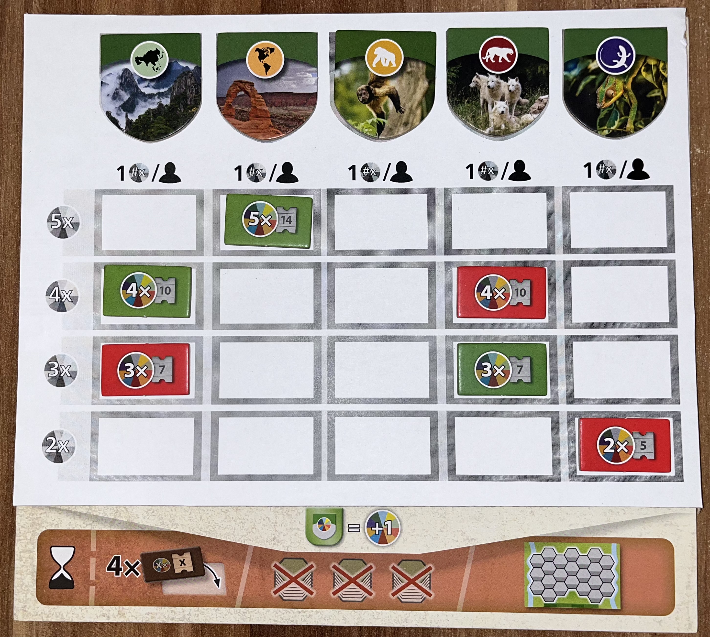

# Artengarten Mini-Erweiterungen: _Kompetitive Artenschutzprojekte und Auslage-Auffrisch-Joker_

> **HINWEIS: Dies ist keine offizielle Erweiterung für Artengarten!**

## Drucken und Spielen

Drucke die [Komponenten](components.pdf) Datei, welche sowohl die Kompetitive Artenschutzprojekte Tafel als auch die Auslage-Auffrisch-Joker enthält, im Standard-A4-Format (210 mm × 297 mm / 8.27" × 11.69"). Für beste Ergebnisse auf Karton drucken und die Tafel sowie die Joker entlang der markierten Linien ausschneiden. Optional können die Komponenten für höhere Haltbarkeit laminiert werden.

## Kompetitive Artenschutzprojekte

Um mit den kompetitiven Artenschutzprojekten zu spielen, lege sie zuerst auf die originale Artenschutzprojekte-Tafel, wobei du sie so ausrichtest, dass die Endspielbedingungen darunter weiterhin sichtbar bleiben. Lege anschließend fünf zufällige Naturschutzziele auf die vorgesehenen Felder. Die Regeln zum Unterstützen eines Ziels bleiben unverändert, mit einer wichtigen Anpassung: Für jedes Ziel darf nur ein Marker pro Multiplikatorwert (x2, x3, x4, x5) verwendet werden. Wenn das Feld, auf das du deinen Marker setzen möchtest, bereits belegt ist, darfst du dort keinen Marker platzieren. Wie zuvor darf jeder Spieler jedes Ziel nur einmal unterstützen.

## Auslage-Auffrisch-Joker

Während des Aufbaus wird festgelegt, ob jeder Spieler einen oder zwei Joker erhält, und diese werden entsprechend verteilt. Zu Beginn des Zuges eines Spielers – genauer gesagt, bevor die erste Aktion ausgeführt wird, in der ein Plättchen aus der Auslage gezogen wird – kann er einen Joker ausgeben, um alle derzeit ausliegenden Plättchen zu entfernen und die Auslage mit neuen Plättchen aufzufrischen; danach läuft der Zug wie gewohnt weiter. Joker werden bei Verwendung dauerhaft abgelegt und können später im Spiel nicht zurückerlangt werden. Wenn Spieler mit zwei Jokern starten, dürfen sie trotzdem nur einen pro Zug verwenden.
